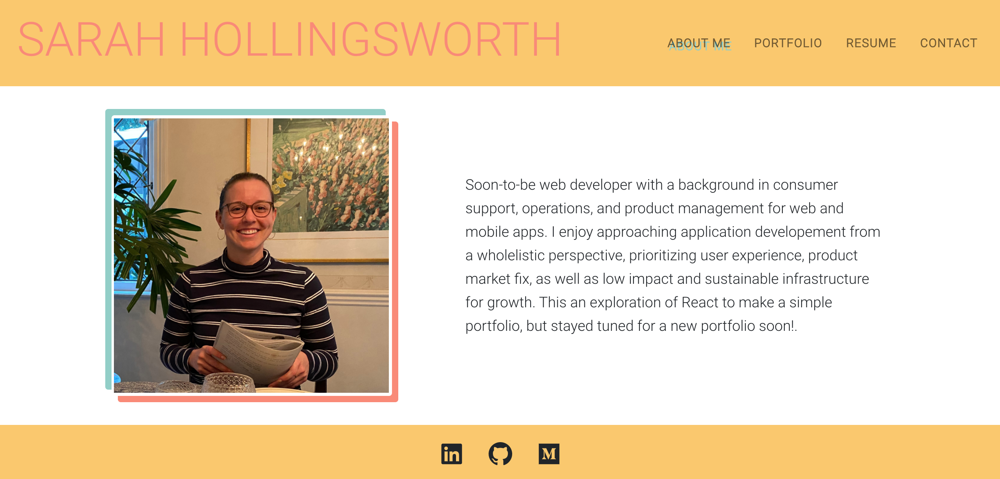

# Sarah Hollingsworth React Portfolio
This portfolio serves as a brief overview of my development experience, including major projects and skills. It also serves as an avenue to learn more about me or contact me directly. This was created as a React app to continue to build experience and familiarity with the React framework given it's commonality in modern websites.

## Summary
[Click here to visit my React portfolio.](https://sahhollingsworth.github.io/portfolio-react/)

### Home Page / About Me section 

* The About Me title and section are selected by default on page load.
* The header includes my name and a page navigation with titles corresponding to different sections of the portfolio.
* Navigation titles include About Me, Portfolio, Contact, and Resume, 
    * When selected, the title corresponding to the current section is highlighted
    * When selected, the user is presented with the corresponding section below the navigation without the page reloading.
* The About Me section includes a recent photo or avatar of me and a short bio.
* The Portfolio section includes titled images of six of my applications with links to both the deployed applications and the corresponding GitHub repositories.
* The Contact section includes a form with fields for a name, email address, and a message
  * If the user moves their cursor out of a selected form field without entering text, then they are notified that the field is required
  * THe email address form field includes validation on email format and notification to user if invalid.
* The Resume section includes link to download my resume and a list of my development proficiencies.
* The Footer contains icons that link directly to my GitHub, LinkedIn, and Medium profiles.

## Installation
Ensure you have Node.js installed locally to install packages to and from the public npm registry. Node.js installation documentation.

1. Clone the repository to your local machine.

2. Install application dependencies `npm install`.
Required when when you first set up the project for local development or use OR if any changes are made to the project's dependencies. More Node information here.

3. Start the application with `npm start`. This will open the app in a new tab in your default web browser. 

## Technologies used
* [Javascript](https://developer.mozilla.org/en-US/docs/Web/javascript) - Core app logic.
* [React](https://reactjs.org/) - Javascript library used to generate all user interfaces.
* [React-Bootstrap](https://react-bootstrap.github.io/getting-started/introduction/) - Bootstrap CSS framework for React projects.
* [React-Icon](https://react-icons.github.io/react-icons/) - React icon package.
* [Node](https://nodejs.org/en/) - Asynchronous event-driven JavaScript runtime environment that executes JavaScript code outside a web browser.
* [NPM](https://www.npmjs.com/) - Node package manager, used in conjunction with JS and Inquirer to support application logic and Command Line interface.
* [CSS](https://devdocs.io/css/) - Used to style html elements on the page as needed beyond Bootstrap.
* [HTML](https://developer.mozilla.org/en-US/docs/Web/HTML) - Used to create elements on the DOM.
* [Git](https://git-scm.com/doc) - Version control system to track changes to source code.
* [GitHub](https://docs.github.com/en) - Hosts the code repository.

## Author
Sarah Hollingsworth
* [Github](https://github.com/sahhollingsworth)
* [LinkedIn](https://www.linkedin.com/in/sarahhollingsworth/)

## License
* Licensed under the [MIT](https://opensource.org/licenses/MIT) license.